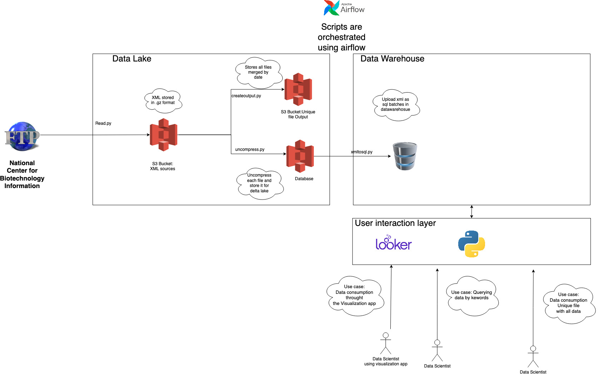

## Consuming from the National Center for Biotechnology Information

## What I'll be doing?

In this project I'll be consuming data from [this](https://ftp.ncbi.nlm.nih.gov/pubmed/updatefiles/) ftp in order to make it available for data scientists as a unique downloadable file. I will also impelemnt the support of querying data by specific keywords and timeframes.

If you get into the mentioned link, you will see that each date 3 files are uploaded:

1. pubmed22n1141.xml.gz 
2. pubmed22n1141.xml.gz.md5
3. pubmed22n1141_stats.html

The first file contains information related to medical publications which is compressed using gz, the second file contains the md5 hash and the last file seems to contain metadata related to how many entries were either added, removed or revisited (updated?)

### Goals

1. To make the data downloadble as a whole
2. To make data queryable for a specific keyword (for example "TP53") and a given frame (Pubdate)

## Solution: Datawarehouse Implementation

In this branch I'll explore another solution: Instead of using a lakehouse architecture I'll be using a database from which applications/users can directly query from. The reason why I'll be exploring this another solution is to be able to compare different approaches, to understand what are the time-consuming tasks that are being removed when using different technologies and what maintance looks like when something changes :)

## Architecture details

The solution I'll be exploring in this branch can be depicted in the following figure:

In this solution I'll be implementing both a data warehouse and a data lake. 

The data lake will contain 3 buckets: The first bucket,`sources-medical-publications`, will be used for fetching files from the sftp and uploading as .gz. We will then apply the following transformations from this step:
1. `createoutput.py` transformation which will create a unique file .gz that contains all uploaded files up to today. This new file will be uploaded to bucket `output-medical-publications`
2. `uncompress.py` transformation which will uncompress the uploaded file and it will upload it in bucket `uncompressed-medical-publications`
3. `xmltosql.py` transformation which will read the uploaded file and insert the new data into a database. For now, we will only have 1 database which will be used as both staging and output (but this may change in the future)

In this approach, the user will still interact with different applications that will provide sql capabilities. The difference is that these applications will interact against the mentioned database.

This approach can be taken because the application we are building is small (just 1 file < 50MB is being uplaoded each day)

### Drawbacks already detected with this approach

1. You need to parse the xml manually. What happens if it changes? 
2. Parsing the xml manually is time-consuming and error-prone
3. How do you keep versioning with this approach?

## Implementation details

TO COMPLETE
