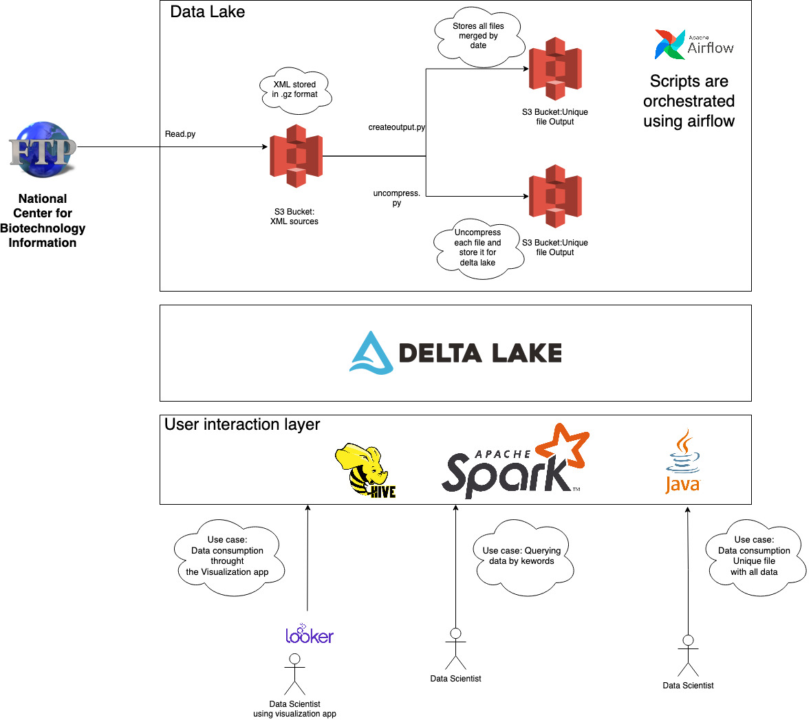

## Consuming from the National Center for Biotechnology Information

## What I'll be doing?

In this project I'll be consuming data from [this](https://ftp.ncbi.nlm.nih.gov/pubmed/updatefiles/) ftp in order to make it available for data scientists as a unique downloadable file. I will also impelemnt the support of querying data by specific keywords and timeframes.

If you get into the mentioned link, you will see that each date 3 files are uploaded:

1. pubmed22n1141.xml.gz 
2. pubmed22n1141.xml.gz.md5
3. pubmed22n1141_stats.html

The first file contains information related to medical publications which is compressed using gz, the second file contains the md5 hash and the last file seems to contain metadata related to how many entries were either added, removed or revisited (updated?)


### Goals

1. To make the data downloadble as a whole
2. To make data queryable for a specific keyword (for example "TP53") and a given frame (Pubdate)


## Solutions

I'll be working in 2 different solutions to compare one against another. The first solution is a lakehouse architecture, which I'm implementing in this branch. The other solution is using a datawarehouse. I'm implementing this second solution in this branch [dw_implementation](https://github.com/andyLaurito92/data-engineering-challenges/tree/dw_implementation) 

## Architecture details

The solution I'm working on in this branch can be depicted in the following architecture diagram:




The idea is to implement a lakehouse architecture using S3 buckets as data lakes. As it can be seen in the image above, I'll be fetching the compress xml files and store them in an initial S3 bucket (also called `sources-medical-publications`). After this upload happens, two scripts will be trigger: 

1. `crateoutput.py`: This script will create a file which will contain the uploaded file + an existing .gz file which contains all the compress files up to the current date. This new file will be stored in bucket `output-medical-publications` using as key the date in which it was generated. This is the file that was requested in goal 1.
2. `uncompress.py`: Will uncompressed the uploaded file and store it bucket `uncompressed-medical-publications` using as key the current date. This bucket will be the source of the delta lake tables.

All the mentioned scrips will be orchestrated using airflow. The current dag for this ETL process can be found in `medicalpublications/pipelines/dags/publications_pipeline.py`

Final users will interact with the `User Interaction Layer`. This layer consists of applications that will enable the final user to query data using as it is being requested in goal 2. The user will be able to use SQL to query this data. 
The `User Interaction Layer` will use delta lake which will enable the SQL format for querying the data allowing ACID operations.

## Implementation details

In this project I'm focusing in reproducibility. It's because of this that I'm focusing on having everything running locally. 

In order to emulate my data lake, I'm using [localstack](https://localstack.cloud/) to simulate S3 buckets locally. 

Currently airflow is being run locally. Next thing to do will be to spin up a dockerized version of airflow for easiest reproducibility. 

Working on: Spinning up delta lake + hive + apache spark. These apps will be used for querying data from the xmls

The current implemented solution just fetches file `pubmed22n1115.xml.gz`.

## Trello

I'm creating all todo/done/future tasks related to this project in [this](https://trello.com/b/oBtTIA9A/consuming-from-the-national-center-for-biotechnology-information) trello.

## Running this project locally

This project contains both `requirements.txt` and `environment.yml` with all dependencies needed to run it locally. You should be able to create a virtual environment using either pip or conda. If you want to create a new environment using conda just run:

``` shell
conda env create -f environment.yml
```

In order to run this project you need docker. If you don't have Docker desktop installed locally and you don't want to pay for it (osx user), there are some other alternatives you can use to run it (kubernetes, podman, between others). Here is a [link](https://dnsmichi.at/2022/03/15/docker-desktop-alternatives-macos-podman-nerdctl-rancher-desktop/) which explains how to replace it.

Once you have docker, just run `./run.sh` to spin up localstack, airflow standalone and to install the python project locally.

Airflow should be accesible from `http://localhost:8080/home` (no username or password required).

Localstack should be accessible from `http://localhost:4566/`. The name of the buckets this project will create can be found in `buckets.sh`. These names are:
1. s3://sources-medical-publications
2. s3://uncompressed-medical-publications
3. s3://output-medical-publications

In order to access a bucket, just do: `http://localhost:4566/${{BUCKET_NAME}}`, for example, in order to access locally bucket `sources-medical-publications` you should go to this url in your browser: `http://localhost:4566/sources-medical-publications`

(At least in my computer) the airflow dag is failing with `Negsignal.SIGSEGV` when trying to run the first node that fetches the xml. There is a ticket created in the trello board to investigate why is this happening. In the meantime, the scripts have to be ran manually.
